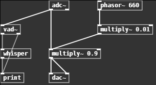

# RASPPPy (Real-time Audio Signal Processing Patcher for Python)

A visual programming language for creating and running audio (and potentially other multimedia) real-time applications created in Python.

<p align="center"></p>

With the rapid developments in audio processing, we now have access to many powerful components that can be used in larger applications. However, creating applications using these new models can take long times to prototype. In the realm of audio, [Pure Data](https://puredata.info/) allows for the rapid prototyping of various audio applications, but interfacing Pd with these newer audio processing tools is quite difficult.

RASPPPy is being developed to try to emulate the rapid prototyping environment of Pure Data, while staying in a python environment for easier integration of newer models. Since most newer machine learning tools are developed and implemented with python and pytorch, RASPPPy provides a near seemless way to integrate new technologies into a prototyping environment.


## Installation

Clone this repository and run
```
pip install .
```
Adjust paths and settings in `config.toml` as necessary.

Installation refinement is still in progress, and I'll get that working in the future. Will probably put onto pypi at some point to make installation easier.

## Running
```
raspppy
```
or
```
python main.py
```
will work. The full argument list is as follows:
```
raspppy [-h] [--config CONFIG] [--electron ELECTRON] [file]

positional arguments:
  file                 optional - file to open

options:
  -h, --help           show this help message and exit
  --config CONFIG      path to alternative config file
  --electron ELECTRON  path to electron executable
```

## Building

Admitedly a mess, will write up later. Not completely standalone yet, need to figure out how to build electron along with eel using pyinstaller (https://github.com/python-eel/Eel/issues/57#issuecomment-426069269), but that's low priority

## Features

### Implemented
- saving and loading patches
- some basic math and dsp
- audio input/output
- some advanced objects for VAD and ASR
- Basic GUI to play patches
- Dynamically loading objects from a specified directory for easy extension

### Planned for near future
- Built in models for TTS, and VC (need to figure out [SOLA](https://github.com/w-okada/voice-changer/blob/master/server/voice_changer/VoiceChanger.py) [algorithm](https://github.com/yxlllc/DDSP-SVC/blob/master/gui.py) consider looking at [this](https://github.com/SillyTavern/SillyTavern-Extras/tree/main/modules/voice_conversion) to see minimum needed files for rvc)
- External for LLMs ([conversation agent patch?](https://arxiv.org/pdf/2304.03442.pdf))
- External for Avatars (Talkinghead or even [Live2d](https://github.com/Live2D/CubismWebSamples))
- Actual GUI editor
- Replicating most of the Pd library of basic blocks
- Refining installation/execution process
- Building into a standalone application

### Planned for far future
- Faster dsp backend (may or may not be possible, need to learn Cython)
- [VST Support?](https://github.com/hq9000/cython-vst-loader)
- Pytorch library of objects for possibly training within the interface
- Wider Multimedia capabilities (e.g. Video using OpenCV, WebGL or Live2D would be cool too)

## Objects

| Group | Implemented | Revision Needed | Planned Soon | Planned | Wishlist |
|--|--|--|--|--|--|
| General | bang, print, trigger | delay, number | send, receive, until, metro, line, loadbang | select, route, pack, unpack, spigot, moses, change, swap, value, timer, pipe | netsend, netreceive
| Math | + | | -, *, /, pow, ==, !=, >, <, >=, <=, &, &&, \|, \|\|, %, <<, >>, mod, div, sin, cos, tan, atan, atan2, sqrt, log, exp, abs, random, max, min, clip, wrap | expr, | mtof, powtodb, rmstodb, ftom, dbtopow, dbtorms
| Data | | | array, table, tabread, tabread4, tabwrite, soundfiler | 
| I/O | | | | key, keyup, keyname, qlist, textfile | everything midi and osc, openpanel, savepanel
| Audio | adc~, dac~ | | vline~, send~, receive~, delwrite~, delread~, | sig~, threshold~, snapshot~, bang~, samplerate~, throw~, catch~, readsf~, writesf~
| Audio Modules | phasor~ | | osc~, tabwrite~, tabplay~, tabread~, tabread4~, tabsend~, tabreceive~, noise~ | vcf~, env~, hip~, lop~, bp~, biquad~, rpole~, rzero~, rzero_rev~, cpole~, czero~, czero_rev~
| Audio Math | *~ | | +~, -~, /~, max~, min~, clip~, sqrt~, wrap~, pow~, log~, exp~, abs~ | expr~, fft~, ifft~, rfft~, rifft~
| Abstraction | | | pd, inlet, outlet, inlet~, outlet~ | clone
| SpeechToolkit* | whisper | vad~ | tts | f0~ | rcv~
| LLM* | llama | | | prompt-template |
| Puppeteering* | | | | | Live2D, VRM, TalkingHead
| CVToolkit* | | | | | cam

\*  External library not in current repository
